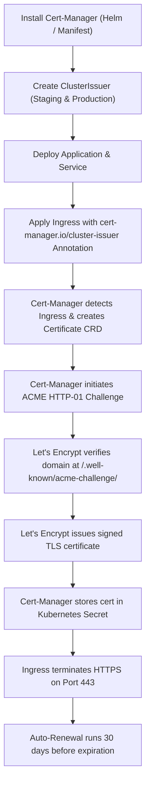

# 🔐 Kubernetes SSL/TLS Certificate Management with Cert-Manager, Ingress & Let's Encrypt

> **A comprehensive, production-grade guide for automated SSL/TLS certificate issuance, validation, and auto-renewal in Kubernetes using Cert-Manager, Ingress Controllers, and Let's Encrypt.**

---

## 📑 Table of Contents

1. [Overview & Core Architecture](#-overview--core-architecture)
   - [What is Let's Encrypt?](#what-is-lets-encrypt)
   - [What is Cert-Manager?](#what-is-cert-manager)
   - [How Automated TLS Works (Architecture & Flow)](#how-automated-tls-works-architecture--flow)
2. [ACME Challenge Solvers: HTTP-01 vs DNS-01](#-acme-challenge-solvers-http-01-vs-dns-01)
3. [Step 1: Install Cert-Manager](#-step-1-install-cert-manager)
   - [Method A: Standard Manifest Installation](#method-a-standard-manifest-installation)
   - [Method B: Production Helm Installation (Recommended)](#method-b-production-helm-installation-recommended)
   - [Verifying the Installation](#verifying-the-installation)
4. [Step 2: Configure Issuers & ClusterIssuers](#-step-2-configure-issuers--clusterissuers)
   - [Issuer vs ClusterIssuer](#issuer-vs-clusterissuer)
   - [Staging ClusterIssuer (Safe Testing)](#staging-clusterissuer-safe-testing)
   - [Production ClusterIssuer (Live Production)](#production-clusterissuer-live-production)
   - [DNS-01 ClusterIssuer for Wildcard Certificates](#dns-01-clusterissuer-for-wildcard-certificates)
5. [Step 3: Configure Ingress with Automated TLS](#-step-3-configure-ingress-with-automated-tls)
   - [Annotated Ingress Example (NGINX / GCE / Traefik)](#annotated-ingress-example-nginx--gce--traefik)
   - [Explicit Certificate Resource (Alternative Method)](#explicit-certificate-resource-alternative-method)
6. [Step 4: Verification & Inspection Workflow](#-step-4-verification--inspection-workflow)
   - [Cert-Manager Object Hierarchy Check](#cert-manager-object-hierarchy-check)
   - [Checking Certificate & TLS Secret](#checking-certificate--tls-secret)
   - [Verifying Live HTTPS with OpenSSL & cURL](#verifying-live-https-with-openssl--curl)
7. [Step 5: Automatic Renewal Lifecycle](#-step-5-automatic-renewal-lifecycle)
8. [Step 6: Troubleshooting & Common Pitfalls](#-step-6-troubleshooting--common-pitfalls)
   - [Troubleshooting Command Cheat Sheet](#troubleshooting-command-cheat-sheet)
   - [Common Failures & Instant Fixes](#common-failures--instant-fixes)
9. [Summary Workflow](#-summary-workflow)

---

## 🌟 Overview & Core Architecture

### What is Let's Encrypt?
[Let's Encrypt](https://letsencrypt.org/) is a free, automated, and open Certificate Authority (CA) provided by the Internet Security Research Group (ISRG). It enables web applications and APIs to enforce HTTPS security with zero license costs.

* **Globally Trusted:** Recognized by all major modern browsers, operating systems, and root stores.
* **90-Day Lifespan:** Promotes security best practices through short-lived certificates and automated rotation.
* **ACME Protocol:** Uses the Automated Certificate Management Environment (ACME) protocol to verify domain ownership automatically without human intervention.
* **Rate Limits:** Enforces production rate limits (50 certificates per registered domain per week, 5 failed validation attempts per account per hour). *Always test with Staging first!*

### What is Cert-Manager?
[Cert-Manager](https://cert-manager.io/) is an open-source, cloud-native Kubernetes controller that automates the provisioning, management, and renewal of SSL/TLS certificates within Kubernetes clusters.

```
                  ┌─────────────────────────────────────────────────────────┐
                  │                 KUBERNETES CLUSTER                      │
                  │                                                         │
  Ingress Event ──┼─► Ingress Controller (e.g. NGINX / GCE)                 │
                  │         │                                               │
                  │         ▼ (Watches Annotations)                         │
                  │   Cert-Manager Controller ──► Creates Certificate CRD   │
                  │         │                                               │
                  │         ▼                                               │
                  │   ACME Client ──── (HTTP-01 Challenge)                  │
                  └─────────┼───────────────────────────────────────────────┘
                            │
               1. Request   │   2. Validate Challenge Path
              Certificate   │   (/.well-known/acme-challenge/*)
                            ▼
                  ┌────────────────────┐
                  │   Let's Encrypt    │
                  │     ACME CA        │
                  └────────────────────┘
```

#### Core Functions of Cert-Manager:
1. **Issuance:** Communicates with ACME CAs (Let's Encrypt, ZeroSSL), HashiCorp Vault, or private CAs to request certificates.
2. **Domain Validation:** Automatically solves HTTP-01 or DNS-01 ACME challenges to prove ownership of the requested domain.
3. **Secret Storage:** Stores the issued certificate (`tls.crt`) and private key (`tls.key`) as a standard Kubernetes `kubernetes.io/tls` Secret.
4. **Auto-Renewal:** Proactively renews certificates before expiration (default is 30 days prior to expiry).
5. **CRD-Driven Lifecycle:** Exposes dedicated Custom Resource Definitions:
   - `Issuer` / `ClusterIssuer`
   - `Certificate`
   - `CertificateRequest`
   - `Order`
   - `Challenge`

---

## ⚖️ ACME Challenge Solvers: HTTP-01 vs DNS-01

Let's Encrypt requires domain validation through one of two main ACME challenge types:

| Feature | HTTP-01 Challenge | DNS-01 Challenge |
| :--- | :--- | :--- |
| **How it Works** | Let's Encrypt requests a temporary token at `http://<domain>/.well-known/acme-challenge/<token>` | Cert-Manager publishes a `_acme-challenge.<domain>` TXT record in your DNS provider |
| **Public IP / Port 80** | **Required:** Port 80 must be publicly reachable from the internet | **Not Required:** Works for private clusters, VPNs, and air-gapped VPCs |
| **Wildcard Support (`*.domain.com`)** | ❌ No | ✅ **Yes** (Only DNS-01 supports wildcards) |
| **Setup Complexity** | Very simple (handled directly by Ingress controller) | Requires API credentials for DNS provider (Route53, Cloudflare, Azure DNS, etc.) |
| **Best For** | Standard public web applications and APIs | Internal services, private networks, and wildcard subdomains |

---

## 🚀 Step 1: Install Cert-Manager

Cert-Manager consists of three core controller deployments:
- **`cert-manager`:** The main controller reconciling Certificate and Issuer resources.
- **`cert-manager-cainjector`:** Injects CA bundles into Webhooks and CRDs.
- **`cert-manager-webhook`:** Dynamic validating and mutating admission webhook.

### Method A: Standard Manifest Installation

Apply the official Cert-Manager release manifest (includes CRDs and controllers):

```bash
kubectl apply -f https://github.com/cert-manager/cert-manager/releases/download/v1.15.0/cert-manager.yaml
```

### Method B: Production Helm Installation (Recommended)

In production, managing Cert-Manager via Helm allows for fine-grained resource tuning, high availability, and Prometheus metrics scraping.

```bash
# 1. Add Jetstack Helm repository
helm repo add jetstack https://charts.jetstack.io
helm repo update

# 2. Install cert-manager with CRDs enabled
helm install cert-manager jetstack/cert-manager \
  --namespace cert-manager \
  --create-namespace \
  --version v1.15.0 \
  --set installCRDs=true \
  --set prometheus.enabled=true \
  --set replicaCount=2
```

### Verifying the Installation

Check that all three controller pods are in `Running` state and CRDs are registered:

```bash
# Check Pods
kubectl get pods -n cert-manager

# Expected Output:
# NAME                                       READY   STATUS    RESTARTS   AGE
# cert-manager-789c687c9-abcde              1/1     Running   0          2m
# cert-manager-cainjector-65c786b59-fghij   1/1     Running   0          2m
# cert-manager-webhook-57f9f784d-klmno      1/1     Running   0          2m

# Check Custom Resource Definitions
kubectl get crds | grep cert-manager.io

# Expected CRDs:
# certificates.cert-manager.io
# certificaterequests.cert-manager.io
# challenges.acme.cert-manager.io
# clusterissuers.cert-manager.io
# issuers.cert-manager.io
# orders.acme.cert-manager.io
```

---

## 🛠️ Step 2: Configure Issuers & ClusterIssuers

### Issuer vs ClusterIssuer

* **`Issuer`:** Scoped to a **single namespace**. It can only issue certificates for resources within that specific namespace.
* **`ClusterIssuer`:** Scoped **cluster-wide**. It can issue certificates for Ingress and workloads across all namespaces.

---

### Staging ClusterIssuer (Safe Testing)

> [!IMPORTANT]
> **Always test new configurations with the Staging environment first.**  
> Let's Encrypt Staging uses generous rate limits. The resulting certificate will not be trusted by browsers (shows "Fake LE Intermediate"), but proves that DNS and challenge routing work without risking production rate limit bans.

Save as `staging-issuer.yaml`:

```yaml
apiVersion: cert-manager.io/v1
kind: ClusterIssuer
metadata:
  name: letsencrypt-staging
spec:
  acme:
    # ACME server URL for Let's Encrypt Staging
    server: https://acme-staging-v02.api.letsencrypt.org/directory
    # Email address used for ACME registration and renewal notices
    email: devops-alerts@yourdomain.com
    # Name of a secret used to store the ACME account private key
    privateKeySecretRef:
      name: letsencrypt-staging-account-key
    solvers:
      # Enable HTTP-01 challenge solver using Ingress
      - http01:
          ingress:
            class: nginx   # Set to your Ingress class: nginx, gce, traefik, alb
```

Apply to cluster:
```bash
kubectl apply -f staging-issuer.yaml
```

---

### Production ClusterIssuer (Live Production)

Once the staging setup validates successfully, switch to the official Production ClusterIssuer.

Save as `production-issuer.yaml`:

```yaml
apiVersion: cert-manager.io/v1
kind: ClusterIssuer
metadata:
  name: letsencrypt-production
spec:
  acme:
    # ACME server URL for Let's Encrypt Production
    server: https://acme-v02.api.letsencrypt.org/directory
    # Email address used for expiry notifications
    email: admin@yourdomain.com
    # Secret where the ACME account key is stored
    privateKeySecretRef:
      name: letsencrypt-production-account-key
    solvers:
      - http01:
          ingress:
            class: nginx   # Change to 'gce' if using GKE Ingress
```

Apply to cluster:
```bash
kubectl apply -f production-issuer.yaml
```

Verify ClusterIssuer status:
```bash
kubectl get clusterissuer
kubectl describe clusterissuer letsencrypt-production
```
*Look for `Status: True` and `Reason: ACMEAccountRegistered`.*

---

### DNS-01 ClusterIssuer for Wildcard Certificates

If you need a wildcard certificate (e.g. `*.yourdomain.com`) or your cluster has no public IP, use a DNS-01 solver.

Example for **AWS Route53**:

```yaml
apiVersion: cert-manager.io/v1
kind: ClusterIssuer
metadata:
  name: letsencrypt-dns01-route53
spec:
  acme:
    server: https://acme-v02.api.letsencrypt.org/directory
    email: admin@yourdomain.com
    privateKeySecretRef:
      name: letsencrypt-route53-key
    solvers:
      - dns01:
          route53:
            region: us-east-1
            # Can use AWS IAM Roles for Service Accounts (IRSA) or access keys
```

---

## 🌐 Step 3: Configure Ingress with Automated TLS

To request a certificate automatically, add the `cert-manager.io/cluster-issuer` annotation to your Ingress resource and define the `spec.tls` section.

### Annotated Ingress Example (NGINX / GCE / Traefik)

Save as `app-ingress.yaml`:

```yaml
apiVersion: networking.k8s.io/v1
kind: Ingress
metadata:
  name: myapp-ingress
  namespace: default
  annotations:
    # 1. Specify the ClusterIssuer to trigger automated certificate request
    cert-manager.io/cluster-issuer: "letsencrypt-production"
    
    # 2. Ingress Controller specific annotations
    kubernetes.io/ingress.class: "nginx"
    nginx.ingress.kubernetes.io/ssl-redirect: "true"
    nginx.ingress.kubernetes.io/force-ssl-redirect: "true"
spec:
  ingressClassName: nginx   # Modern Kubernetes 1.18+ syntax
  tls:
    - hosts:
        - myapp.yourdomain.com
      secretName: myapp-tls-secret   # Cert-Manager will save the issued certificate here
  rules:
    - host: myapp.yourdomain.com
      http:
        paths:
          - path: /
            pathType: Prefix
            backend:
              service:
                name: myapp-service
                port:
                  number: 80
```

Apply the Ingress:
```bash
kubectl apply -f app-ingress.yaml
```

---

### Explicit Certificate Resource (Alternative Method)

If you prefer to decouple certificate management from the Ingress resource, you can declare an explicit `Certificate` Custom Resource:

```yaml
apiVersion: cert-manager.io/v1
kind: Certificate
metadata:
  name: myapp-certificate
  namespace: default
spec:
  secretName: myapp-tls-secret
  issuerRef:
    name: letsencrypt-production
    kind: ClusterIssuer
  commonName: myapp.yourdomain.com
  dnsNames:
    - myapp.yourdomain.com
    - www.myapp.yourdomain.com
  duration: 2160h     # 90 days (default)
  renewBefore: 720h   # Renew 30 days before expiration
```

---

## 🔍 Step 4: Verification & Inspection Workflow

### Cert-Manager Object Hierarchy Check

When an Ingress with TLS annotations is applied, Cert-Manager triggers a chain of resources:

```
Ingress ──► Certificate ──► CertificateRequest ──► Order ──► Challenge ──► TLS Secret
```

Follow this sequence to inspect every stage:

```bash
# 1. Check Certificate Status
kubectl get certificates -n default

# Expected Output:
# NAME               READY   SECRET             AGE
# myapp-tls-secret   True    myapp-tls-secret   2m

# 2. Check Certificate Details and Events
kubectl describe certificate myapp-tls-secret -n default

# 3. Inspect CertificateRequest
kubectl get certificaterequests -n default

# 4. Inspect ACME Order
kubectl get orders -n default

# 5. Inspect ACME Challenge (while validation is in progress)
kubectl get challenges -n default
```

---

### Checking Certificate & TLS Secret

Once the certificate is issued, Cert-Manager creates a Kubernetes Secret containing:
- `tls.crt`: The full certificate chain
- `tls.key`: The private key

```bash
# Check Secret existence
kubectl get secret myapp-tls-secret -n default

# View Secret Details
kubectl describe secret myapp-tls-secret -n default

# Decode and inspect Certificate expiry date directly from the cluster
kubectl get secret myapp-tls-secret -n default -o jsonpath="{.data['tls\.crt']}" | base64 -d | openssl x509 -noout -text | grep -A 2 "Validity"
```

---

### Verifying Live HTTPS with OpenSSL & cURL

Verify your domain from your local terminal:

```bash
# 1. Inspect SSL Handshake and Certificate Authority Issuer
curl -Iv https://myapp.yourdomain.com

# 2. Check Expiry and Subject Alternative Names with OpenSSL
echo | openssl s_client -showcerts -servername myapp.yourdomain.com -connect myapp.yourdomain.com:443 2>/dev/null | openssl x509 -inform pem -noout -text | grep -E "Issuer|Subject|Not After"
```

---

## 🔄 Step 5: Automatic Renewal Lifecycle

1. **Validity Period:** Let's Encrypt certificates are valid for **90 days**.
2. **Renewal Trigger:** Cert-Manager automatically initiates renewal **30 days** before expiration (at day 60).
3. **Zero Downtime:**
   - The ACME challenge is performed in the background while the existing certificate is still valid.
   - Upon successful validation, the Secret `myapp-tls-secret` is updated atomically.
   - Ingress controllers (e.g. NGINX, Traefik) automatically reload the updated certificate without dropping active client connections.

```bash
# Manually trigger a certificate renewal (for testing):
cmctl renew myapp-tls-secret -n default
```

---

## 🛠️ Step 6: Troubleshooting & Common Pitfalls

### Troubleshooting Command Cheat Sheet

| Task | Command |
| :--- | :--- |
| **Check Cert-Manager Logs** | `kubectl logs -n cert-manager deploy/cert-manager -f` |
| **Check Webhook Logs** | `kubectl logs -n cert-manager deploy/cert-manager-webhook -f` |
| **Describe Certificate** | `kubectl describe certificate <cert-name> -n <namespace>` |
| **Describe Challenge** | `kubectl describe challenge <challenge-name> -n <namespace>` |
| **Describe Ingress** | `kubectl describe ingress <ingress-name> -n <namespace>` |

---

### Common Failures & Instant Fixes

#### 1. Challenge Stuck in `Pending` or `Invalid` (HTTP-01)
* **Root Cause 1:** The DNS A record for `myapp.yourdomain.com` is not pointing to the external IP of the Ingress LoadBalancer.
  - *Fix:* Verify DNS propagation: `dig +short myapp.yourdomain.com`. Ensure it matches `kubectl get ingress`.
* **Root Cause 2:** Firewall or Cloud Security Group blocks incoming traffic on **Port 80**.
  - *Fix:* Let's Encrypt HTTP-01 requires inbound HTTP on port 80. Ensure port 80 is open to `0.0.0.0/0`.
* **Root Cause 3:** Mismatched `ingress.class`.
  - *Fix:* Verify the class in the `ClusterIssuer` matches your Ingress Controller (`nginx`, `gce`, `traefik`, etc.).

#### 2. Let's Encrypt Rate Limit Exceeded
* **Error:** `too many certificates already issued for exact set of domains` or `too many failed authorizations`.
* **Fix:** 
  - Switch your Ingress to use `letsencrypt-staging` while debugging.
  - Wait for the Let's Encrypt 1-hour / 7-day rate limit window to expire.

#### 3. CAA Record Blocking Issuance
* **Error:** `CAA record does not allow issuance`.
* **Fix:** If your domain uses CAA DNS records, ensure an entry allows Let's Encrypt:
  ```dns
  yourdomain.com. IN CAA 0 issue "letsencrypt.org"
  ```

#### 4. Webhook Connection Refused during `kubectl apply`
* **Error:** `Internal error occurred: failed calling webhook "webhook.cert-manager.io"`.
* **Fix:** Check that the `cert-manager-webhook` pod is running and that GKE / EKS control plane firewalls allow traffic to port `10250` / `6443`.

---

## 📊 Summary Workflow



---

## 📁 Related Manifests in this Directory

* **[`01-staging-clusterissuer.yaml`](./01-staging-clusterissuer.yaml)** — Let's Encrypt Staging ClusterIssuer for risk-free testing.
* **[`02-production-clusterissuer.yaml`](./02-production-clusterissuer.yaml)** — Production Let's Encrypt ClusterIssuer.
* **[`03-dns01-route53-clusterissuer.yaml`](./03-dns01-route53-clusterissuer.yaml)** — DNS-01 ClusterIssuer for wildcard & private certificates.
* **[`04-ingress-tls.yaml`](./04-ingress-tls.yaml)** — Production Ingress with SSL redirect & TLS configuration.
* **[`05-certificate-crd.yaml`](./05-certificate-crd.yaml)** — Standalone Certificate CRD definition.

